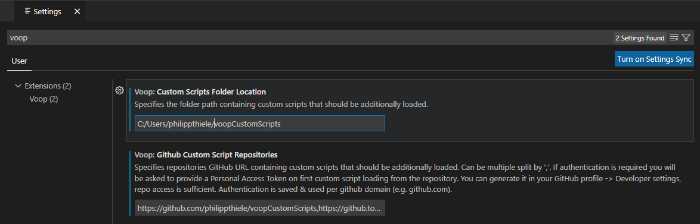
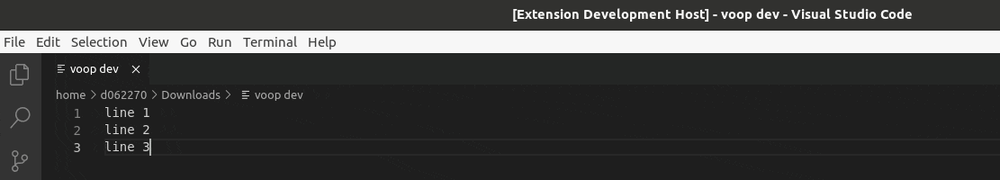
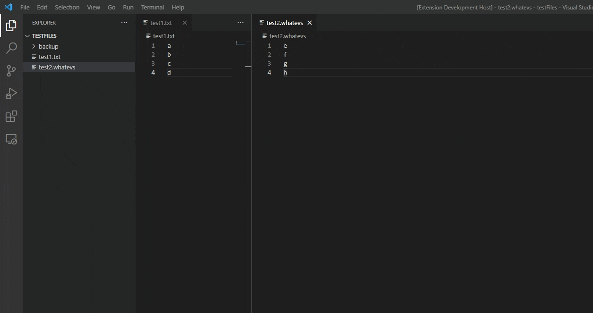

# Custom Scripts

- [Custom Scripts](#custom-scripts)
	- [Setup](#setup)
	- [Writing Custom Scripts](#writing-custom-scripts)
		- [Meta info](#meta-info)
		- [The Main Function](#the-main-function)
		- [Script Execution](#script-execution)
		- [Properties](#properties)
		- [Functions](#functions)
			- [Editing](#editing)
			- [Messaging](#messaging)
		- [Debugging](#debugging)

## Setup

To use custom scripts, you need to tell Voop where to find them.  
You can set a local custom scripts folder and GitHub repositories as additional source for scripts in your VSCode User Settings (search for voop).  


An example of a custom script GitHub repository that can be added: https://github.com/philippthiele/voopCustomScripts

You can directly open your custom script folder in the current VSCode Workspace by executing (`Ctrl+Shift+P`) - `Voop: Open Custom Script Folder`

## Writing Custom Scripts

You can easily extend Voop with custom scripts to add your own functionality. Each script is a self-contained Javascript file that is loaded at app launch. If you make something cool or useful, feel free to submit a PR and share it with everyone else!

### Meta info

Each script starts with a declarative JSON document, describing the contents of that file, a title, a description, which icon to use, search tags, and more. All that stuff is contained within a top level comment (with some extra asterisks) just like so:

```javascript
/**
	{
		"api":1,
		"name":"Generate UUID",
		"description":"RFC4122 version 4 compliant UUID",
		"author":"Briguy37 & tietze111",
		"tags":"uuid,guid,unique"
	}
**/
```

* `api` is not currently used, but is strongly recommended for potential backwards compatibility. You should set it to 1.
* `name`, `description` and `author` are exactly what you think they are, `name` and `description` are also used to filter during script selection.
* `icon` is not used and only needs to be added if you want to keep a script compatible with Boop (see [Origins of Voop](https://github.com/philippthiele/Voop#origins-of-voop))
* `tags` are used during script selection to filter the results.
* `userInput` whether user input is accepted after script selection. As an example how to accept it, check the [JoinLines](scripts/JoinLines.js) script. User Input Demo Gif: 

* `multiFile` whether a script works with multiple files. If it does, script execution is only done when a user selects multiple via the context menu and executes `Voop` from there. Transformations done by the script are opened in a new file. An example is the [CombineFiles](scripts/CombineFiles.js) script. Multi File Demo Gif: 



### The Main Function

Your script must declare a top level `main()` function, that takes in a single argument of type `ScriptExecution`. This is where all of the magic happens.

Your script will only be executed once, just like a web browser would at page load. Anytime your script's services are requested, `main()` will be invoked with a new execution object. 

```js

function main(input) {
    // Do something useful here (or not)
}

```

### Script Execution

The script execution object is a representation of the current state of the editor. This is how you modify the text. A new execution object will be created and passed down to your script every time the user invokes it. Once your `main()` returns, values are extracted from the object and put back in the editor.

The only exception from this rule is when a user invokes a script on multiple selected files via the context menu:  
- If a script has multiFile support, then all files with contents are passed to your script. The script can use the contents to compile a new string and put it into the text property. This will then be opened in a new file (see multiFile description in [Meta info](#meta-info) chapter).
- If a script does not have multiFile support, the script will be invoked on every selected file individually. 

### Properties

Script execution objects have four properties to deal with text: `text`, `fullText`, `selection`.

* `text` contains the selection if any text is selected, otherwise contains the entire documents contents like fullText. When modified in the script, replaces the selected text or the entire document when no text is selected.
* `fullText` will contain entire documents content, regardless of whether a selection is made or not. *Can also be modified like text and replaces the full document. Modifications are ignored when text property is also modified.*
* `selection` will contain the currently selected text. *Can also be modified like text and replaces the selection. Modifications are ignored when text or fullText property is also modified.*
* `files` an array of objects that itself have the properties `name` and `text`. This property is only set when the script has multiFile enabled (see multiFile description in [Meta info](#meta-info) chapter). Modifications to these file representation objects are not written back to the files. Use the passed information in your script to compile a new string and put it into the text property. This will then be opened in a new file. An example is the [CombineFiles](scripts/CombineFiles.js) script.

```js

let selectedText = input.selection // get
input.fullText = "Replace the whole text" // set

input.text = "this could be a selection or a whole"

```

**Hint**: It is good practice to only modify the text property if sufficient for your wished functionality, as this will adapt dynamically to whether the user has selected text or not.  There are scenarios though where this is not sufficient, e.g. if you want to change the whole document based on a users selection.

### Functions

Script executions objects have a few functions that can be used to interact with the editor text, and present feedback to the user.

#### Editing

The `insert()` function takes in a single string argument, and inserts it at the caret position. If there is a selected piece of text, it will be replaced with the provided string.

```js

input.insert("Hello, World!")

```

Multiple inserts are possible in a single script, they will be inserted sequentially in the order they were added.

```js

input.insert("1")
input.insert("2")
input.insert("3")

// => "123"

```


#### Messaging

Script execution objects have additional functions to communicate with the user, called `postInfo()` and `postError()`. These functions take in a single string argument, that will be presented to the user.

```js

input.postInfo(`${ lines.length } lines removed`)
input.postError("Invalid XML")

```

### Debugging

If you write a more complex script you probably want/need to debug it at some point. Maybe you even want to debug some existing scripts to understand how the script development works better. Voop leverages the VSCode debugger to make scripts debuggable.

To start a debugging session, just execute (`Ctrl+Shift+P`) the `Voop: Start Debugging Session` command. This will open your currently open file and/or workspace VSCode window and attach the debugger to it. When you now execute any Voop script in, including your custom ones, it will be enriched with a debug entry point where it will always stop so you can debug through your script. Since Voop loads the scripts on-the-fly and does not require it to them be full JavaScript modules, setting breakpoints in the script will not work, but you can add additional `debugger;` statements in your script as in the debugging entrypoint, if you need to stop at a specific line more often.

https://user-images.githubusercontent.com/1737722/172684348-2ae6dc94-e02f-4bc9-bbda-4fb95d31c413.mp4
