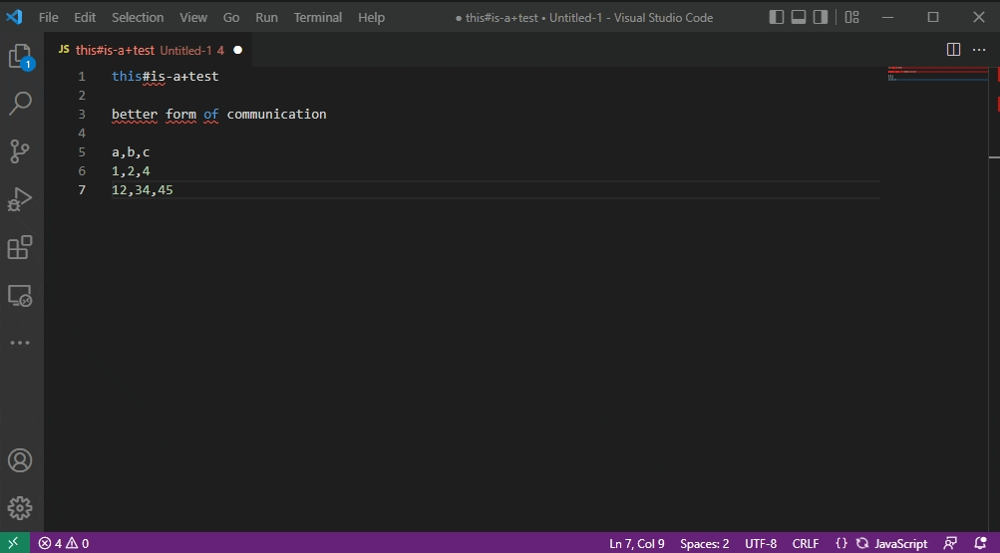

# Voop
Convert, En- & Decode, Format, Tranform, Hash any (selected) text & add own simple JS scripts to extend with any functionality you need

## What is it exactly?
Voop is a way to execute Boop scripts directly in VSCode. It was created based on the idea and the scripts of [Boop](https://github.com/IvanMathy/Boop), which is a scriptable scratchpad that allows you to run any transformations on your text using the built-in or your self-written .js scripts.

## Featured Functionality List
These functions are usually executed on the whole document or on the selection if some text is selected.

- (Un-)Escape Text (add/remove backslashes before " & ')
- (En-) & Decode Base64, JWT, HTML Entities, URLs
- Convert JSON <-> YAML, CSV <-> JSON, HEX -> RGB, Hex <-> Dec <-> Binary, Date <-> Timestamp <-> UTC Timestamp
- Hash: MD5, SHA1, SHA256, SHA512
- Format & Minify: JSON, XML, CSS, SQL
- Count: Lines, Words, Characters
- Transform text to upper/lower, camel, kebab, snake, start, sponge case, trim
- Sort / Shuffle lines
- Add your own JS scripts to provide any functionality you'd like
- and more ...

## How to get Voop

You can get Voop from the [Visual Studio Code Marketplace](https://marketplace.visualstudio.com/items?itemName=PhilippT.voop).

## How to activate Voop in VSCode

Press `Ctrl+Shift+P` and enter `Voop`. Execute `Voop` to get a list of available scripts, execute `Voop: Reload Scripts` to update the list of available scripts after adding custom scripts to the custom scripts folder.

Use `Ctrl+Alt+V` as a quick alias for `Ctrl+Shift+P` + `Voop`.

## Custom Scripts

You can set the custom scripts folder in your VSCode User Settings (search for voop). For documentation on how to develop custom scripts refer to the original Boop documentation: https://github.com/IvanMathy/Boop/blob/main/Boop/Documentation/CustomScripts.md

## Development

- Clone or download a copy of the repository
- Open the repo in vscode
- Press `F5` to open a new window with your extension loaded.
