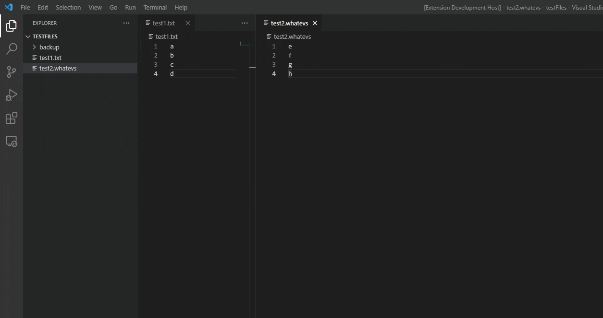
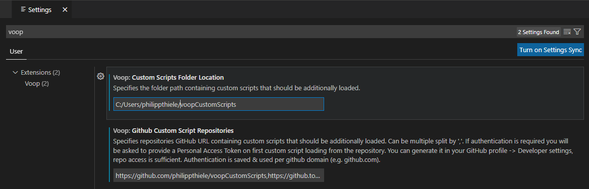

# Voop
Convert, En- & Decode, Format, Tranform, Hash any (selected) text or files & add own simple JS scripts to extend with any functionality you need
## Featured Functionality List
These functions are usually executed on the whole document or on the selection if some text is selected.

- (Un-)Escape Text (add/remove backslashes before " & ')
- (En-) & Decode Base64, JWT, HTML Entities, URLs
- Convert JSON <-> YAML, CSV <-> JSON, HEX -> RGB, Hex <-> Dec <-> Binary, Date <-> Timestamp <-> UTC Timestamp
- Hash: MD5, SHA1, SHA256, SHA512
- Format & Minify: JSON, XML, CSS, SQL
- Count: Lines, Words, Characters
- Transform text to upper/lower, camel, kebab, snake, start, sponge case, trim
- Sort / Shuffle lines
- Duplicate to current or new file
- Add your own JS scripts to provide any functionality you'd like
- and more ...

## How to get Voop

You can get Voop from the [Visual Studio Code Marketplace](https://marketplace.visualstudio.com/items?itemName=PhilippT.voop).

## How to activate Voop in VSCode

Press `Ctrl+Shift+P` and enter `Voop`. Execute `Voop` to get a list of available scripts, execute `Voop: Reload Scripts` to update the list of available scripts after adding custom scripts to the custom scripts folder.  

If you want to open the transformation result in a new file instead, press `Ctrl+Shift+P` and execute `Voop: Transformation Result in new File`.

Use `Ctrl+Alt+V` as a quick alias for `Ctrl+Shift+P` + `Voop`.  
Use `Ctrl+Alt+N` as a quick alias for `Ctrl+Shift+P` + `Voop: Transformation Result in new File`.  

Select multiple files in the VSCode Explorer and right-click (opens context menu) + click `Voop` to execute scripts on multiple files at once. Modifications done via this operation can be turned back by using  `Ctrl+Shift+P` + `Voop: Undo last multifile action (last 5 max)` or also via the context menu.

## Origins of Voop & extended functionality
Voop is a way to execute Boop scripts directly in VSCode. It was created based on the idea and the scripts of [Boop](https://github.com/IvanMathy/Boop), which is a scriptable scratchpad that allows you to run any transformations on your text using the built-in or your self-written .js scripts.

Voop can accept user input after script selection if needed. As an example how to accept it, check the [JoinLines](scripts/JoinLines.js) script.  

Voop scripts can also be executed on multiple files at once using the context menu.

Also Voop has script native multi-file support to use multiple file contents as an input, where the result will be opened in a new file. An example how this can be used is the [CombineFiles](scripts/CombineFiles.js) script.  

## Custom Scripts
Documentation on how to develop custom scripts: [Custom Script Development](CustomScriptDevelopment.md)

You can set a local custom scripts folder and GitHub repositories as additional source for scripts in your VSCode User Settings (search for voop).  

An example of a custom script GitHub repository that can be added: https://github.com/philippthiele/voopCustomScripts

## Development

- Clone or download a copy of the repository
- Open the repo in vscode
- Press `F5` to open a new window with your extension loaded.
